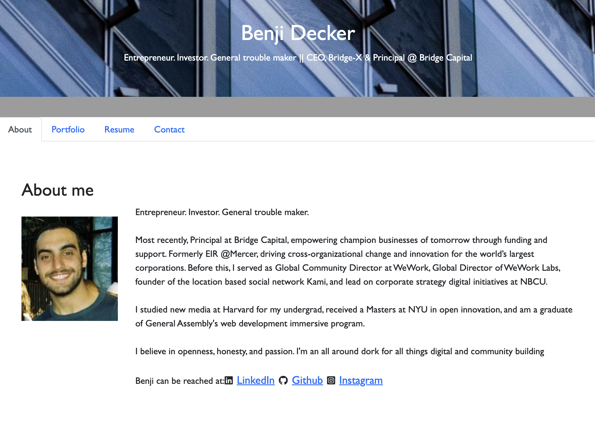

# ReadMe - Module 20 Challenge 📝

## Description 

This application is portfolio site, designed to showcase the author's bio, projects, resume, and contact info.  The site is built using react, to create a seamless, single-page format, further demonstrating the author's skillset and comfort with advanced technologies

View below for more info, as well as the Github repo, the Pages link, and a screenshot of the app in action.  

Github: [link here](https://github.com/BenjiCCB/challenge-20)

Pages deployment: [link here](https://benjiccb.github.io/challenge-20)

---

## Table of Contents 

* [Descripton](#description)

* [Installation Instructions](#installation-instructions)

* [Usage Information](#usage-information)

* [App License](#app-license)

* [Contribution Guidelines](#contribution-guidelines)

* [Testing Instructions](#testing-instructions)

* [Questions](#questions)

---

## Installation Instructions 

Instalion of the app is quite straighforward... simply run 'npm install' in the top level directory, then 'npm run start' to begin the server on port 3000.  For the Github Pages version, no instllation is necessary

---

## Usage Information 

This application is extremely simple to use. Once running, simply click to visit each one of the a site's sections, including the About Me, the Portfolio, the Resume, and the Contact section (note validation functionaly in Contact the section, and download option in the Resume)

---

## App License 

This app is covered under the following license: None

---

## Contribution Guidelines 

This app was developed indepentently, though all suggestions are welcome

---

## Testing Instructions 

Feel free to try finding bugs, although hopefully there shouldn't be any!

---

## Questions 

For more information and questions, please contact me at <bensdecker@gmail.com> or by visiting my [github account](https://github.com/benjiCCB)